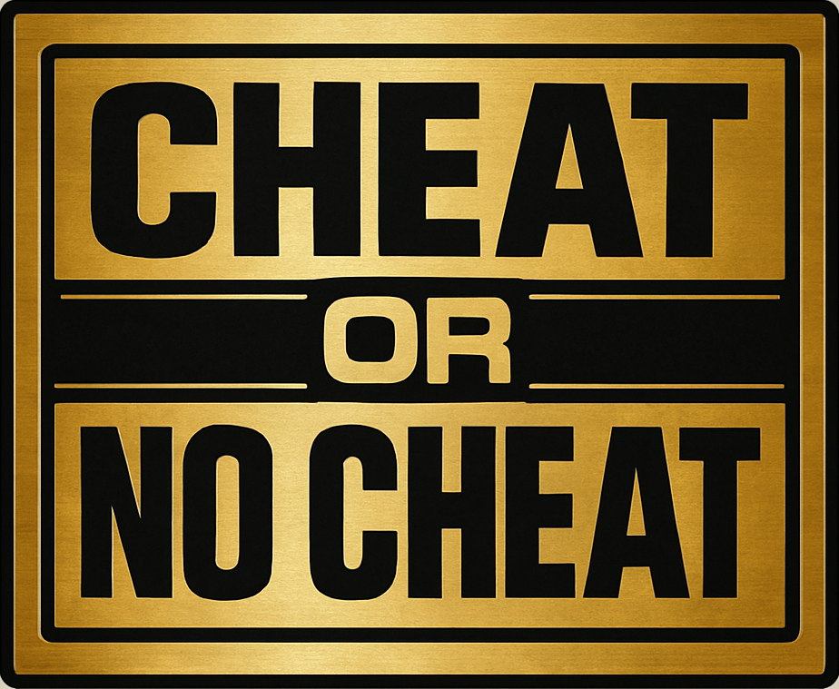

<p align="center">
  
</p>

Tools to compare code from knitted Rmd HTML files, flag suspicious similarity, review and label potential copying, visualize patterns, and generate reports.

## Table of contents

- [Setup](#setup)
- [What is measured](#what-is-measured)
- [What this tool is not](#what-this-tool-is-not)
- [CLI](#cli)
- [Demo](#demo)
- [GUI](#gui)
  - [Analyze](#analyze)
  - [Review flagged pairs](#review-flagged-pairs)
  - [Side-by-side preview](#side-by-side-preview)
  - [Labeling (Cheated / No Cheating)](#labeling-cheated--no-cheating)
  - [Save Assignment](#save-assignment)
  - [Statistics](#statistics)
    - [Heatmap](#heatmap)
    - [Trends](#trends)
    - [Network](#network)
  - [Report](#report)
- [Data](#data)

## Setup

```bash
# 1) Clone the repository
git clone https://github.com/rmharp/CheatorNoCheat.git
cd CheatorNoCheat

# 2) Install Python 3.12 (macOS with Homebrew)
brew install python@3.12

# 3) Create and activate a virtual environment
python3.12 -m venv .venv   # or: python3 -m venv .venv

# macOS/Linux
source .venv/bin/activate
# Windows (PowerShell)
# .\\.venv\\Scripts\\Activate.ps1

# 4) Install dependencies
pip install -U pip setuptools wheel
pip install -r requirements.txt

# 5) Run the GUI
python gui_qt.py
```

## What is measured

- Jaccard similarity (token-based) after code normalization.
- Sequence similarity using Python’s `difflib.SequenceMatcher` ratio (shown as "Sequence").
- Thresholds for Jaccard or Sequence scores can be adjusted in the GUI/CLI.

## What this tool is not

This tool is not a substitute for manually reviewing student submissions for cheating. The similarity scores used here are helpful proxies to highlight pairs with unusually similar code, but a high score does not necessarily mean a student has cheated. The intent is to reduce the time required for instructors, TAs, or graders to review all submissions by surfacing a smaller, curated set of suspicious pairs for manual human review and judgment.

## CLI

```bash
python compare_rmd_html_code.py /path/to/submissions --open-flagged --open-limit 3 \
  --seq-threshold 0.82 --jaccard-threshold 0.70 --top-n 50
```

Quick demo using included fictitious data:

```bash
python compare_rmd_html_code.py sample_data/HW_Demo --open-flagged --open-limit 2 --seq-threshold 0.50 --jaccard-threshold 0.50
```

## Demo

<p align="center">
  
</p>

1) Analyze any folder (e.g., `sample_data/HW_Demo`) and then click "Statistics…"
2) In the Network tab, set Min co-flag count to 2 to show pairs who cheated together more than once.
   The included demo creates repeated co-flags for Alice–Bob and Bob–Dana across HW1–HW3.

Outputs next to the selected directory:
- `suspicious_pairs.csv`, `suspicious_pairs.txt`, `suspicious_pairs.json`
- `manual_labels.csv` (appears after you vote in the GUI)

`--open-flagged` opens up to N flagged pairs for quick side-by-side inspection.

## GUI

```bash
python gui_qt.py
```

### Analyze

- Pick a directory containing student HTML exports (e.g., download assignment from Canvas and rename folder to HW1, HW2, ...). The tool searches subfolders recursively.
- Configure thresholds and Top N, then click "Analyze".
- Results are written to the folder and displayed in the main table.

### Review flagged pairs

- The table can be set to show flagged pairs (default, capped to Top N) sorted by overall similarity.
- Click a row to preview that pair.

### Side-by-side preview

- Two embedded browsers render the selected student HTMLs side by side.
- Filenames are shown above each pane.

### Labeling (Cheated / No Cheating)

- "Cheated" and "No Cheating" buttons record your decision to `manual_labels.csv`.
- Navigation (Prev/Next) lets you move through pairs quickly.

### Save Assignment

- After Analyze, click "Save Assignment…", name the assignment, and optionally enter a category (e.g., Homework, Lab).
- This stores results under a shared parent folder: `.cheatornocheat/assignments/<AssignmentName>/` next to the submissions directory.

### Statistics

#### Heatmap

- Choose an assignment and metric (Jaccard/Sequence), then "Draw Heatmap".
- The colorbar/figure replaces in place on redraw.

#### Trends

- Filter by category and select a student. Toggle "All students" to overlay everyone’s max similarity per assignment.
- "Cheaters only" limits the student list to those who were ever labeled "cheated".
- An assignment checklist lets you include/exclude specific assignments in the plots.

#### Network

- Interactive Plotly graph of co-flagged students:
  - Edges are drawn only for pairs manually labeled "cheated".
  - Edge width = co-flag count; edge opacity = max Jaccard (context only).
  - Min co-flag count and edge metric (count / max_jaccard / max_sequence) are configurable.
- Category and an independent assignment checklist let you focus the network.
- Edge count badges show how many assignments each pair was flagged on.

### Report

- Go to the Report tab, choose a category and assignments, then "Generate Report…".
- A single HTML file is created with:
  - Table of contents
  - By student (cheaters): dropdown per student listing partners per assignment with similarity values
  - By assignment: dropdown per assignment listing cheaters, summary stats (mean/median/std) for Jaccard/Sequence on flagged pairs, and a heatmap image
  - Network section for the selected assignments

## Data

- Analysis outputs (`suspicious_pairs.*`) and `manual_labels.csv` are written beside your chosen submissions directory.
- Saved assignments live under the parent of the chosen directory:
  - `…/<submissions_parent>/.cheatornocheat/assignments/<AssignmentName>/`
- The GUI reads from these saved folders to power Statistics and Report.
